Tēnā koe

## **Official Information Act Request**

Thank you for your request under the Official Information Act 1982 (OIA) on 18 January 2024:

*I would like to make an Official Information Act enquiry to understand how NCEA results map to Australian ATAR ranks. I understand from this webpage https://www2.nzqa.govt.nz/international/nz-quals-overseas/study-with-ncea/australia/ that a "methodology agreed by Australasian Conference of Tertiary Admission Centres" is used to compute ATARs for NZ students. I wish to understand this methodology. If there is a formula or program or spreadsheet used to calculate this mapping I would like to obtain a copy.*

### **Response**

On 29 January 2024, we attempted to contact you via email to clarify your request. We have not yet received a response. We have therefore interpreted your request to be for an explanation of NZQA's methodology when converting NCEA results into ATAR scores and any relevant documents to help understand this process.

NZQA calculates ATAR scores on behalf of Australian tertiary admission centres for every eligible student in January each year. We use methodology agreed by Australasian Conference of Tertiary Admission Centres.

The following documents, attached to this response provide details of the ATAR conversion as well as the research papers on the methodology used by NZQA:

- Information about ATAR Calculations
- Coxon, D (2011) *ITARS and Related Calculations*
- Johnston, M, Lillis, D (2011) *Statistical Modelling and analysis of NCEA and New Zealand Scholarship assessment data*.

The ATAR calculation is not only a mapping of one student's results to a given ATAR, but a ranking. It can be better understood as a mapping of all students results to a set of ordered categories (0.05% percentile increments). Everyone's ATAR score depends not just on their results, but on how everyone else did as well. These calculations are based on individual student results, therefore, only NZQA and other educational organisations can produce the calculations.

The programme used by NZQA for these calculations is based on a code the operation of which will only provide you with a series of numbers and will not be useable without access to NZQA's internal data base. Therefore, we have not considered this to be part of what you are requesting.

Your response will be published on our website after five working days. Your name and contact details will be removed before publication.

If you require further assistance or believe we have misinterpreted your request, please contact Elizabeth Templeton in the Office of the Chief Executive, email elizabeth.templeton@nzqa.govt.nz or telephone (04) 463 3339.

You have the right to seek an investigation or review by the Ombudsman of this decision under section 28(3) of the Official Information Act 1982. Details of how to make a complaint can be found at www.ombudsman.parliament.nz. You can also telephone 0800 802 502 or write to the Ombudsman at PO Box 10152, Wellington, 6143.

Nāku nā

 $\overrightarrow{a}$ 

Dr Grant Klinkum Pouwhakahaere/Chief Executive

## Information about ATAR Calculations

## **Australian Tertiary Admission Rank (ATAR) scores**

Each state has its own education system which requires common statistics to compare results from different states. The ATAR (also known as the Interstate Transfer Index - ITI) is used to compare and rank Australian Year 12 students (Australian Year 12 is New Zealand Year 13 and NCEA Level 3). The ATAR ranks students from 99.95 to 0 with 99.95 being the top score.

## **NCEA to ATAR Conversion Process**

NZQA uses a statistically-based process to produce ATAR scores from NCEA results. The methodology was developed, overseen, and regularly reviewed by the Australasian Conference of Tertiary Admission Centres (www.ACTAC.edu.au). It begins with an analysis of all results in all level 3 standards by all students with a secondary enrolment in an academic year in January of the following calendar year. The outcome is a relative difficulty weighting for each academic year, standard, standard version, and result combination. This statistic is applied to the result and credits for each standard and standard version.

ATAR scores are based on each students best 90 NCEA Level 3 credits with a maximum of 24 credits from a subject. Where a standard is repeated only the best result is used and the other discarded. Where more than 90 credits are available only the best 90 are used.

Standard results are prioritised with those from University Entrance (UE) approved subjects being used ahead of those from non UE approved subjects. Achievement standards are used ahead of unit standards. Within each category, standard results with a higher difficulty weighting ahead of standards with a lower difficulty ranking. Externally assessed achievement standards are typically ranked higher than internally assessed achievement standards for the same subject and result. It is often the case that Achieved or Merit results in one standard contribute more to a higher ATAR score than an Excellence in a different standard (but of course, in the same standard an excellence is better).

The combined credit weighted score from a students best 90 credits is compared to other students in their cohort to determine their ATAR score. The standard difficulty comparison process means 90 excellence credits is not enough to guarantee a student gets the top ATAR score.

All available (at the time of the ATAR calculation) NCEA level 3 or above standard results from all completed academic years are taken into account for a student's ATAR score and the best 90 are used. Standard difficulty for the year the student did the standard is used to calculate their ATAR score, and if a student repeats a standard to get a better result, the best result and its academic year will be used.

An ATAR score of 99.90 means a student ranked in the top 0.05% to 0.10% of their age cohort - which includes those who have left school, those studying under other assessment systems and those already undertaking tertiary study.

ATAR scores are not calculated for students with less than 60 NCEA Level 3-and-above assessed credits from completed academic years.

## **Entry Requirements and Predicted ATAR Scores**

The Australian University system is very competitive. Each institution sets its own admission requirements and criteria for assessing students. Institutions publish potential minimum ATAR scores for admission to courses as guidance but students need to meet subject prerequisites and may also be interviewed, auditioned, or required to submit a portfolio on top of the ATAR requirement.

To achieve a very high ATAR score a student needs to get as many excellence and merit results as possible in externally and internally assessed achievement standards in UE approved subjects (especially the externally assessed standards).

As ATAR scores are calculated each academic year using the results of all students undertaking level 3 standards it is not possible to predict ATAR scores in advance or from the same set of results from a prior year because they are different.

We don't do predicted ATAR score requests for this reason.

Students need to ensure that their final year course will enable them to meet the subject prerequisites for the institution and course they want entry to. This might mean taking more credits in achievement standards in more subjects than their classmates so they meet Australian subject criteria and can be compared to Australian students. Students will need to meet the Universities and the States entry requirements. This will be in addition to the ATAR course requirement. State requirements may include English requirements (NCEA Level 3). Even where English is required the ATAR will only use NCEA level 3 English standards if they are in a student's best 90 credits.

NZQA recommends that students contact the institution they wish to attend as early as possible to ensure that their year 13 course will enable them to meet the entry requirements.

Contact details for tertiary admission centres and universities are available from the ACTAC website at www.ACTAC.edu.au

## **How and When Results get to Australia**

The Australian State exam cycles are around 6 weeks earlier than New Zealand's. NZQA does not know unless told by Australian Tertiary Admission Centres and Universities, who has applied for entry in Australia so we calculate ATAR scores and have results ready for all NCEA students, before results release so they can meet the Australian offer cut-off dates.

Australian Tertiary Admission Centres and some Universities can log into the NZQA website to access the NCEA results and ATAR scores for students that have applied for admission. If the student's tertiary release indicator (privacy flag) is set to "No" then the results are not released by NZQA. Students can check this with their school management system.

If students results change they should tell the Admission Centres or Universities that their results have changed as a result of the review and reconsideration process for them to reretrieve the ATAR score.

An incremental ATAR process is run daily from shortly after results release to update for new or changed results in the last academic year (including late marks, reviews and reconsideration and summer school results) - this calculates a new rank based on the standard difficulties calculated earlier in the year. Students can move brackets without displacing other students as a result of the daily updates. The daily ATAR task turned off well before the new ATARs are calculated the following year.

The Australian education system treats New Zealand citizens as domestic interstate students who typically apply through a Tertiary Admission Centre. All others are treated as international students and must apply as such. NZQA recommends students contact the institutions they wish to enroll at in advance to confirm the process they need to follow and documentation requirements.

NZQA does not provide students with official documentation of ATAR scores as they are only relevant for admission to Australian tertiary institutions and these institutions can access this information electronically.

Students can obtain their ATAR scores by contacting the PRS team (Psychometrics, Statistics and Reporting) at NZQA +64 4 4633000 or 0800 697 296 once NCEA results are released in January each year (or send an email to PRS@nzqa.govt.nz with full name, NSN, Date of Birth and last school attended before results release and NZQA will email the ATAR score once results are released – bypassing telephone queues associated with results release).

## Some Specific Cases:

- In 2017 288 students gained 90 or more level 3 excellence credits (298 in 2016), not all of whom were in Year 13. If prior achievement is included, 586 students who achieved one or more level 3 standards in 2017 ended that academic year with 90 or more level 3 excellence credits (564 in 2016).
- There are about 32 students allocated to each 0.05 ATAR score.
- An ATAR or 99.50 or better means a student is in the top  $0.50\%$  of their cohort using an Australian measure of achievement based on NCEA level 3 results.
- A student with 90 excellence credits from internally assessed standards can receive a significantly different ATAR score to a student 90 excellence credits from externally assessed standards.
- Two students with the same number of excellence credits from the same subjects could receive very different ATAR scores if they took different standards.
- A student achieving 112 excellence credits from only 3 subjects (eg 36 in Health) Education, 40 in Social Studies and 36 in Te Reo Rangatira) would only be able to use 72 of them for their ATAR due to the 24 credit maximum per subject rule and so could receive a different ATAR score to a student with only 90 excellence credits but made up of 18 from each of five subjects.

## **Statistical modelling and analysis of NCEA and New Zealand Scholarship assessment data**

#### Michael Johnston1\* and David Lillis2

1Faculty of Education, Victoria University of Wellington, PO Box 600, Wellington and 2New Zealand Qualifications Authority, PO Box 160, Wellington 6140

New Zealand's main qualification system for senior secondary school comprises the three levels of the National Certificate of Educational Achievement (NCEA). These qualifications were introduced progressively, Level 1 first becoming available in 2002, Level 2 in 2003, and Level 3 in 2004. Additionally, the present system for awarding New Zealand Scholarship was first implemented in 2005. The NCEA system has several features that are quite unique, and that afford schools the opportunity to develop their own assessment programmes for a wide variety of courses in traditional, emerging, and cross-disciplinary subject areas. Those features of the NCEA system that afford this flexibility also present challenges from the psychometric point of view. In this paper, we describe a range of statistical modelling and analyses undertaken by the New Zealand Qualifications Authority (NZQA) to meet these challenges.

The NCEA system is criterion-referenced rather than normreferenced. This means that assessment results depend on the performance of candidates against set criteria, rather than being determined relative to the performance of other candidates.

Criterion-referencing is not unique to NCEA. Indeed, a movement from norm-referenced to criterion-referenced assessment is evident in many assessment systems around the world (e.g. Australia and the United States). Criterion-referenced assessment results and qualifications arguably carry greater inherent meaning than those based on norm-referencing because, if a candidate meets the criterion for a particular result, it is possible, within the limits of the reliability and validity of the assessment, to certify him or her as competent in the specific skill or knowledge associated with that criterion. Under a norm-referenced system, the only information that can be inferred validly from a candidate's result are the percentages of other candidates who demonstrated higher or lower performance.

From a psychometric perspective, running a high-quality criterion-referenced system is more challenging than running a norm-referenced system. Under the latter, all that is required is an accurate rank-order of the candidates, with normative scaling used to allocate final results on the basis of that rank order. Differences in the difficulty of an assessment (for example, a formal examination) from year to year do not affect outcomes unless these would result in a different rank ordering of candidates.

Under a criterion-referenced system, however, the standard of performance commensurate with the criterioa must be maintained over time. Under any assessment system the connection between candidates' performance in an assessment and the final results must entail expert judgement, and cannot be established on a purely statistical basis. However, in a large-scale criterionreferenced system such as NCEA, professional judgement requires a great deal of statistical and psychometric support if criteria are to be applied consistently across different assessors and over time.

Perhaps the most unique aspect of NCEA is its decomposition of assessment into units known as 'standards'. Whereas, under most secondary assessment systems internationally, candidates receive a single result for each subject they have studied, under NCEA candidates receive multiple results, each certifying specific skills and knowledge. For example, there is a trigonometry standard, called Solve right-angled triangle problems, and another pertaining to English-language literacy called Read and understand unfamiliar texts.

\*Correspondence: Michael.Johnston@vuw.ac.nz

Michael Johnston has recently commenced as a senior lecturer in the School of Educational Policy and Implementation at Victoria University. He was previously a senior statistician at the New Zealand Qualifications Authority, where he conducted research, analysis and evidence-based policy development for a range of reforms to assessment systems for NCEA and New Zealand Scholarship. Dr Johnston qualified for his PhD at the University of Melbourne. He has extensive experience in experimental psychology and other quantitative research in social science and education. He is a member of the New Zealand Assessment Academy and of the Technical Overview Group (Assessment), an independent committee of academics providing technical advice to NZQA.

David Lillis is a senior statistician with the New Zealand Qualifications Authority (NZQA). He holds a PhD from Curtin University in Western Australia. At NZQA he conducts a wide range of data analysis, including the analysis of NCEA and New Zealand Scholarship results. In particular, he writes software in the R language for Item Response Theory as one approach to ensuring the high quality of secondary examinations. Dr Lillis is a past president of the New Zealand Association of Scientists.

It is this aspect of NCEA that affords its great flexibility, because schools can choose standards that best reflect the content of their courses, and can assess cross-disciplinary courses by selecting relevant standards from more than one subject area. Nonetheless, maintaining consistency of assessment judgements over the approximately 700 standards that are derived from the New Zealand curriculum presents a difficult psychometric problem. In part, this is because there are so many standards, but mainly it is because the assessment for each standard is necessarily of shorter duration and entails a smaller volume of work than would be the case if assessment were conducted at the level of the subject. The difficulty that this situation presents is one of maintaining assessment reliability - shorter and smaller-volume assessments tend to have poorer reliability than longer or larger volume assessments (assuming similar assessment quality).

In this paper we describe a number of statistical processes that assist NZQA to meet the challenges posed by the design of NCEA in relation to external assessment; that is, assessment procedures designed and administered by NZOA, a large majority of which are time-limited examinations. Internal assessments, those designed and conducted in schools and moderated by NZQA, also comprise a very important component of NCEA, and NZQA does have procedures for monitoring the reliability of teachers' internal assessment judgements. However, discussion of these procedure is beyond the scope of the present paper.

The processes we discuss here are as follows: the development and use of Profiles of Expected Performance (PEPs), used as a guide to maintain standards during the marking of external assessments; a set of post-hoc analyses of NCEA examination results, carried out annually following each external assessment round in order to assess the performance of examination items and papers; and statistical procedures used to assist in the allocation of results for New Zealand Scholarship assessments, as well as analysis of the quality of these examinations.

The analyses described here are used to inform, rather than replace, expert judgement. Collectively, these procedures provide assessment practitioners with support for their professional judgement, and with information that enables them to maintain and improve their consistency in applying the various assessment criteria of each standard.

### **Profiles of expected performance**

In the early years of NCEA it was found that, for many externally assessed standards, the proportions of candidates receiving each grade fluctuated from year to year. Given that the system was very new, some variations were to be expected. However, the size of the variation was, in many cases, large even in light of the circumstances. It soon became evident that some form of statistical support for professional judgement was required to maintain consistency in the application of the standards over time.

Profiles of Expected Performance (PEPs) were introduced in 2005 to address the problem of variations from the expected results distributions from one year to the next. The PEP gives a percentage range into which each grade – Not Achieved (N), Achieved (A), Merit (M) and Excellence  $(E)$  - is expected to fall. For example, we might expect that in a given standard 20–32% of candidates will earn an Achieved grade, or that 6-10% will receive Excellence. Figure 1 shows the 2010 PEP bands for the Level 3 Calculus standard 90636 (Integrate functions and use integrals to solve problems).

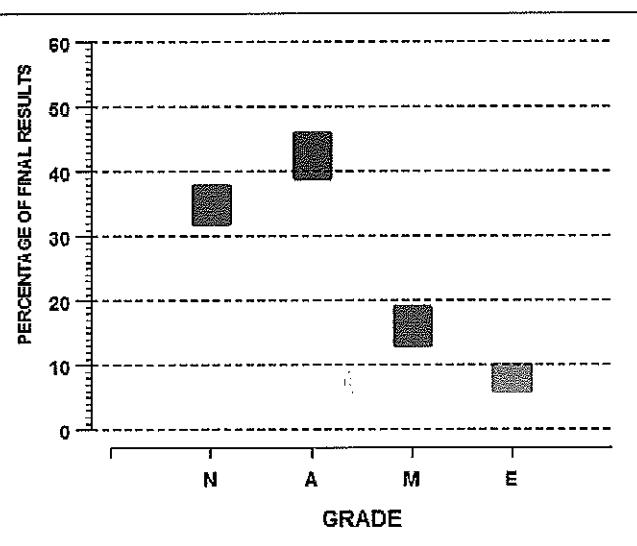

Figure 1. Profiles of Expected Performance for the Level 3 Standard: Integrate functions and use integrals to solve problems (2010).

It is not the intention of the PEP process to manipulate results to fit a pre-determined distribution. Rather, the expected statistical stability of distributions of large numbers of results is used to identify discrepancies that might signal a variation in the standard of performance required for particular grades. It is quite permissible for actual results to fall outside PEP ranges. However, when this occurs, there must be a defensible explanation for the discrepancy that does not entail any implicit change in the performance criterion.

If, during marking, it appears that any of the grades will fall outside the expected range for a particular standard, a discussion is held between NZQA and the leader of the marking panel to discuss reasons for the difference. If there is a legitimate reason (for example, that the characteristics of the cohort have changed in some way, or that there has been an overall improvement or deterioration in performance), then the distribution stands unchanged. If, on the other hand, the reason does not appear to be legitimate, then the marking schedule may be revised. For example, an easier examination than those of previous years is not an acceptable reason for result falling outside PEPs; notwithstanding the difficulty of an examination, candidates must meet the same standard each year in order to receive a particular grade.

A PEP is generated for each grade in each externally-assessed standard in which at least 300 candidates have entered. Below this number, the statistical stability of distributions of results is insufficient to justify the development of a PEP. All PEPs are set prior to each year's examination round, taking into account the history of results for the standard, as well as statistical estimates of the distribution expected on the basis of the previous year's candidature across other standards.

PEPs for standards with large cohorts are set with tighter confidence bands than those with smaller cohorts. Small cohorts lead to lower stability than large cohorts. A substantial change in cohort size from the previous year may also justify setting a larger confidence band, because usually it is not possible to predict in advance the characteristics of the larger cohort.

Draft PEPs are set initially on the basis of the history of results for the standard, as well as professional knowledge of the subject area and candidature. Usually the PEPs for a standard will be the same or very similar from year to year. Following the development of the draft PEPs, other statistical information is taken into account, perhaps prompting a revision of the draft. This statistical information includes analysis of the difficulty of the standard and the overall ability of the cohort, based on the previous year's results.

Measurement of the difficulty of a standard T, involves comparing the relative performance of candidates undertaking T, with their performance on each other standard  $T_{ij}$ ,  $T_{i2}$ ...,  $T_{in}$ that has an overlapping cohort (i.e. a set of candidates who undertake both assessments) with  $T_i$ . Figure 2 gives a diagram of this situation: there is a target standard,  $Ti$ , and two other standards with overlapping cohorts:  $T_{\mu}$  and  $T_{\mu}$ . (In a real world example there would be many overlapping standards.) The overlapping cohorts for the pairs  $T_i$ ,  $T_{ii}$ , and  $T_i$ ,  $T_{i2}$  are labelled  $c_{y1}$  and  $c_{y2}$  respectively.

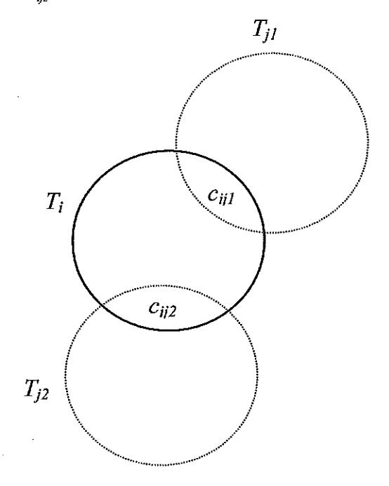

Diagram depicting overlapping cohorts for **Figure 2.** a target standard,  $T_p$  and two other standards,  $T_{ji}$  and  $T_{j2}$ . The overlapping cohorts are designated  $c_{ij}$  and  $c_{ij}$  respectively.

Equation 1 provides a formal method for determining the difficulty of a target standard relative to other standards with overlapping cohorts. The difficulty of  $Ti$  compared to other standards can be estimated by calculating a mean difference in the rate of success for the cohort  $c_{ij}$  on  $T_i$  and the rate of success for the same cohort on each other standard  $T_t$ .

The average differences in rates of success are in fact weighted averages, in which the magnitudes of the weights are determined by the relative sizes of the overlapping cohorts and by the correlation in performance between the target standard and each overlapping standard. Weighting by the size of the overlap places greater emphasis on comparisons involving standards with larger common cohorts, because larger overlaps result in more reliable comparisons.

The correlation in rate of success measures the extent to which performance in a pair of standards draws upon similar knowledge, skills, or cognitive functions. Clearly, if performance in two standards is uncorrelated (i.e. if the value of the correlation coefficient is zero), then the question of their relative difficulty does not arise. On the other hand, if performance in two standards were completely correlated (i.e. the value of the correlation coefficient were unity), then performance on one would be completely predictable from performance on the other, and they would be fully comparable in difficulty. In practice, correlations are never perfect, and although the theoretical minimum correlation is negative one (a negative correlation indicating an inverse relationship in performance), correlations in performance on pairs of standards as low as zero are very rarely, if ever, observed.

Equation 1 gives a mathematical expression that is used to calculate the relative difficulty of a standard using information on candidate performance across all standards held on NZQA's results databases.

$$
D_{i} = \frac{\sum_{j=1}^{n} c_{ij} \rho_{ij} [ R_{ij}(j) - R_{ij}(i) ]}{\sum_{i=1}^{n} c_{ij}}
$$

Equation 1. Difficulty (D) of a standard i, where  $c_n$  is the number of candidates undertaking both standard i and each other standard j,  $\rho_{_{\rm{ij}}}$  is the magnitude of the correlation (Spearman's  $\rho$ ) between standard i and each other standard j,  $R_{\rm s}$  (i) is the rate of success in standard i of the overlapping cohort,  $R_{\mu}$  (j) is the rate of success of the overlapping cohort in standard j, and n is the total number of standards with cohorts overlapping that of standard i.

If the success rate in standard *i* is high (i.e. the standard is easier than an overlapping standard  $j$ ), then the success rate of the overlapping cohort in that standard,  $R_{ij}(i)$ , is higher than the success rate of that cohort in the overlapping standard  $R_{\mu}$ (*j*). In this case the difference  $R_{ij}(j) - R_{ij}(i)$  is negative and decreases  $D_i$  slightly. Conversely, standards that are difficult relative to comparison standards increase the magnitude of  $D_i$ . The denominator is the sum of all cohort sizes and is intended to constrain the magnitude of  $D$ , to a useful range of values.

The cohort strength uses a slightly different comparison (see Equation 2).

$$
S_{i} = \frac{\sum_{j=1}^{n} c_{ij} \rho_{ij} [R_{ij}(i) - R_{j}(j)]}{\sum_{j=1}^{n} c_{ij}}
$$

Equation 2. Strength (S) of a cohort in standard i, where  $c_{\mu}$ is the number of candidates undertaking both standard i and each other standard j,  $\rho_{_{\rm{H}}}$  is the magnitude of the correlation (Spearman's o) between standard i and each other standard  $j, R_s$  (i) is the rate of success in standard i of the overlapping cohort,  $R_i$  (j) is the rate of success in standard j of candidates undertaking standard j but not standard i, and n is the total number of standards with cohorts overlapping that of standard i.

In this case, rather than comparing rates of success of a cohort in a target standard with rates of success in other standards, we compare the performance of the cohort undertaking both the target standard and each comparison standard, with the cohort undertaking the comparison standard only. If the cohort of the target standard is strong, then any subset of that cohort (that subset overlapping with comparison standards) will tend to have a higher rate of success on that standard than the cohort taking the other standards only. In ths case the difference in rates of success will be positive and the estimate of cohort strength will be commensurately high.

## Post-hoc analysis of NCEA external assessments (examinations)

Every year NZQA undertakes a variety of statistical analysis and modelling of NCEA examination results, to contribute to continuous improvement of the quality of examination items and papers, and marking procedures. These analyses include tests of the dimensionality of the examinations and the inter-correlations of the examination items (questions) in order to determine the extent to which they measure on a single continuum of performance. Further analyses use a specialised branch of psychometric statistics, Item Response Theory (IRT), to determine the extent to which examination items are of appropriate difficulty and that they discriminate sufficiently between candidates of varying abilities.

For each examination, a sample of results from 700 examination scripts, or as many as are available, is analysed, focusing both on the performance of each item and on the examination as a whole. The analyses are designed to assist examiners in developing future examinations, and to develop items that measure candidates' performance consistently, both with respect to the standards and with respect to other items.

External assessments (examinations) for NCEA are designed to assess on a single dimension of performance, so that a single criterion for each grade is located on that single dimension. This is in part because there are many standards, resulting in a relatively short examination time for each standard. Some are examined in as little as 40 minutes, although from 2013 the minimum examination time for any standards will be one hour. From a purely statistical perspective, measurement on a single dimension requires that the data (candidates' item-level results) can be fitted to a single (quantitative) scale. In fact, the IRT techniques used to asses the difficulty and discrimination of each item are predicated on uni-dimensionality.

We use Principal Components Analysis, a technique first discussed by Pearson (1901), to explore the dimensionality of the external assessments as reflected in candidates' item grades. Principal Components Analysis is a widely-used dimension reduction technique in which observations of correlated variables are expressed as linear combinations of those variables, each combination constituting a principal component (or dimension).

Each principal component accounts for a proportion of the total variance in the data. The first accounts for the greatest variance, and subsequent principal components account for progressively smaller proportions. One approach to depicting principal components graphically is the scree plot (Cattell 1966). Figure 3 shows a scree plot for the item-level results for a sample of 597 scripts from the 2010 Level 1 Biology examination for standard 90168 (Describe biological ideas relating to how humans use and are affected by micro-organisms).

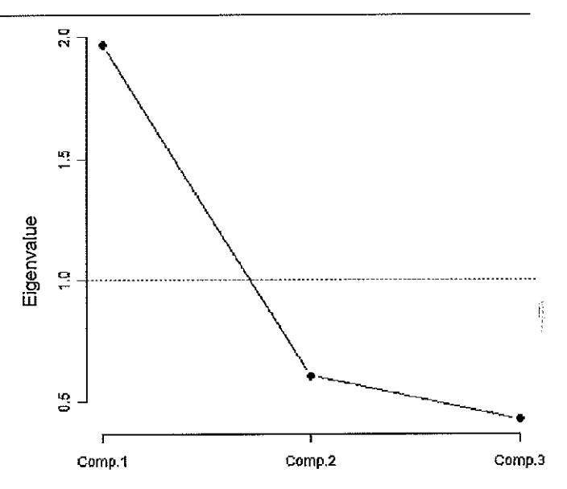

Figure 3. A scree plot showing the factor structure for the three item examination for Biology 90168 in 2010.

This particular examination comprised three items.

The vertical axis of the plot measures the magnitudes of the principal component eigenvalues. Eigenvalue magnitudes are proportional to the total variance in the data explained by each dimension. The horizontal axis of the plot displays each of the possible principal components or dimensions, one for each of the three items, arranged in order of decreasing magnitude.

How many significant dimensions (i.e. different kinds of skill or knowledge) are represented in Figure 3? One commonly-used criterion is that the eigenvalue of a significant dimension should be greater than 1. This criterion was proposed initially by Kaiser (1960), although other criteria for judging the significance of principal components have been suggested, often based on ratios of the first few eigenvalues. Because NCEA external examinations are designed to measure on a single continuum of performance, we expect only the first eigenvalue to explain a substantial fraction of the total variance.

The plot of Figure 3 suggests the presence of just one significant principal component, thus confirming the suitability of the data for the item response. We can identify those items that contribute to a particular dimension by examining the factor loadings (the correlation coefficients between the variables and principal components). Table 1 gives the factor loading of each item of the Biology examination on the first principal component.

Table 1. Item loadings on the first principal component for Biology 90168 (2010 examination round).

| ltem | Correlation with component 1 |  |  |
|------|------------------------------|--|--|
| Q1   | 0.59                         |  |  |
| Q2   | 0.54                         |  |  |
| O3   | በ 60 .                    |  |  |

Loadings close to unity indicate strong relationships between the items and the components. If the examination results indicate only one dominant dimension, then most or all of the items have loaded strongly on the first principal component. Loadings above about 0.4 indicate substantial correlation with a principal component or dimension. Table 1 shows that the three items of Biology 90168 all had moderately strong, and very similar, loadings on the first, dominant component.

For the purpose of quantitative analysis, we can treat the items on any examination that measures a single dimension as forming a distinct scale (i.e. a set of related items that measure collectively an aggregate of responses over those items). The squared factor loading gives the proportion of variance in the item results explained by a factor.

Table 2 shows two further measures of the internal consistency (or how closely related a set of item responses are when taken as a group) for the three items of the same examination for Biology 90168. These measures are the inter-item correlations and item-total correlations. They complement Principal Components Analysis in helping us to quantify the consistency of the item results and to establish the dimensionality of the examination. Both of these measures range from  $-1.0$  to 1.0, though in practice we never encounter negative correlations between items.

Table 2. Inter-item and Item Correlations for the three Items (Q1 - Q3) comprising the assesment for Biology 90168 in 2010.

| Item | Q1   | Q2   |      | Total |  |
|------|------|------|------|-------|--|
| Q1   | 1.00 | 0.43 | 0.58 | 0.60  |  |
| Q2   | 0.43 | 1.00 | 0.44 | 0.49  |  |
| Q3   | 0.58 | 0.44 | 1.00 | 0.60  |  |

Inter-item correlations indicate the strength of the relationships between pairs of items. Any two items that belong to the same dimension tend to exhibit strong inter-item correlation. Correlations between about 0.4 and 0.7 are considered optimal. Very high correlations (say about 0.85 or more) suggest redundancy (i.e. that we could have assessed the candidates' skills and knowledge with the same reliability using a shorter examination based on fewer items). From Table 2 we see that the correlations for the Biology standard 90168 are in this optimal range.

The item-total correlation for each item is given in the final column of Table 2. This measure is the correlation between the responses for each item and the sum of the responses for the remaining items. The item-total correlation assists in the identification of any items that are not consistent with the other items of the assessment scale. A value below 0.4 is taken as an indication that the item does not correlate well with the scale overall. In the development of psychometric tests and surveys, often such items are removed entirely. For the items of Table 2, we see that the item-total correlations of the Biology examination lie well above this threshold.

The third measure of internal consistency that we use for NCEA and New Zealand Scholarship is Cronbach's alpha (Cronbach 1951), another commonly-used measure, also ranging between -1.0 and 1.0. Cronbach's alpha can be expressed as a function of the number of test items and the average inter-correlation among the items. Cronbach's alpha tends to increase as the inter-correlations among the items increase.

The ideal range for Cronbach's alpha is from about 0.7 to about 0.85, values greater than 0.85 indicating strong homogeneity and possibly redundant items. Redundant items do not provide additional information about candidates, but simply add to the length of the assessment or test. Values substantially lower than 0.7 indicate that some items are not measuring on the same dimension as the examination as a whole.

### Item Response Theory

Item Response Theory refers to a family of statistical models used to assess the quality of psychometric tests and assessments. IRT is used to inform the design, analysis and scoring of tests, questionnaires and assessment instruments, and measures abilities, attitudes and other latent traits. It is widely used internationally in the development and analysis of educational assessments.

The parameters of interest to NZQA are the difficulty of attaining a particular grade for each item, and the item discrimination, which measures how well an item discriminates between candidates of different abilities. A third parameter of interest is the ability, a measure of each candidate's performance across the entire examination (see a later section for a discussion of the ability parameter).

We use IRT to investigate the quality of our externallyassessed standards, and have developed several related approaches for conducting these analyses. Currently, we use a twoparameter graded-response model (Samejima 1969) to estimate both candidates' abilities and item parameters (discrimination and the difficulty of each assessment grade). Here, the probability of obtaining a particular grade or better (Not Achieved, Achieved, Merit, or Excellence), for a candidate of ability  $\theta$ , is given by equation 3:

$$
P_j(\theta) = \frac{\exp [ka (\theta - b_j)]}{1 + \exp [ka (\theta - b_j)]}
$$

#### Equation 3. Probability of achieving a particular grade or better for a candidate of ability $\theta$ under Samejima's Graded Response Model (1969) on an item of difficulty bj and discrimination a and where $k = -1.7$ .

In equation 3 the subscript  $j$  indexes the assessment grades Achieved (A) or better, Merit (M) or better, and Excellence (E),  $\theta$  is the calculated ability (which you can also think of as a measure of performance),  $P_i$  is the probability of achieving a particular grade or better for a candidate of ability  $\theta$ , a is the fitted item discrimination, and bj is the estimated difficulty of gaining either an A or better, M or better, or an E grade for the item. Equation 3 describes a logistic curve, and the constant k takes a value of 1.7, which scales the logistic curve such that it closely approximates a cumulative ogive. In the two-parameter model we are required to estimate the parameters a andeach b: (four parameters in total), in addition to candidates' ability parameters (one for each candidate).

#### Candidate ability

Ability is a multi-dimensional concept, and cannot be measured uniquely for any person. In fact, the constructs we wish to measure, such as mathematical, scientific or linguistic abilities, are actually a synthesis of many related abilities and skills. Abilities are calculated for each candidate on the basis of the entire complement of item grades. In fact, abilities estimated from IRT can provide better measures of performance than aggregates of marks or raw grade point averages, because ability estimates take explicit account of the discriminative and difficulty properties of each item.

In IRT we use an ability scale which may be thought of as representing the set of skills, abilities and knowledge that

contribute to performance. This scale is calibrated to have has a mean of zero and ranges (theoretically) from negative to positive infinity. The units of ability are known as 'logits', where a logit is given by equation 4.

$$
logit[P(\theta)] = exp[ka(\theta - b_j)]
$$

Equation 4. Definition of the logit - the unit of ability in psychometrics.

#### **Item difficulty**

For a dichotomous (two-category) item (yes or no; right or wrong, etc.), item difficulty is defined as the point on the measurement scale at which the probability of success is 0.5. For a polytomous item that carries several possible grades (usually the case for NCEA and tertiary examinations), we must estimate a difficulty parameter for each available grade, except the lowest.

#### Item discrimination

Item discrimination is the gradient of the item characteristic function at the point at which the probability of correct response is 0.5 (i.e. the value of the derivative of the function at this point), and theoretically can range between zero and infinity. The steeper the curve, the more highly the item discriminates between candidates of differing abilities, because, when the value of th gradient is high, small variations in ability give rise to significant differences in the probability of attaining a particular grade. However, very high discrimination values are undesirable for the same reason that very high item-total correlations are undesirable; they indicate redundancy amongst items. The ideal range for the discrimination is between about 1.0 and about 3.0. Table 3 shows the item parameters for the 2010 examination for Biology 90168.

Difficulty and discrimination parameters for Table 3. Biology 90168 under Samejima's Graded Response Model  $(1969).$ 

| Item | <b>Discrimination</b> | <b>Difficulty</b> (AME) | <b>Difficulty</b> (ME) | <b>Difficulty</b> (E) |
|------|-----------------------|----------------------------|---------------------------|--------------------------|
| Q1   | 1.51                  | $-1.52$                    | 0.37                      | 2.15                     |
| Q2   | 0.73                  | $-2.57$                    | 0.59                      | 4.68                     |
| Q3   | 2.43                  | $-0.41$                    | 0.54                      | 1.75                     |

We see that all of the discrimination parameters of Table 3 fall within the desirable range. We also see that the items vary considerably in difficulty at each grade. In particular, it is relatively easy to obtain an *Achieved* grade or better in item 2 while for the same item it is very difficult to obtain Excellence.

#### Item characteristic curves

In IRT we depict graphically the performance of an item using item characteristic curves; plots showing the probability of achieving each available grade for an assessment as functions of candidates' ability. Figure 4 gives an example of a two-parameter item characteristic curve for an item that carries four grades, as is the case for NCEA external examinations and many examinations at tertiary level. The four curves represent the probabilities of achieving each grade for all candidates responding to the item. Each item in a given examination or test has its own unique set of characteristic curves.

The horizontal axis is the measurement scale on which candidates' abilities and item difficulties are estimated, and the vertical axis gives the probability of achieving a particular

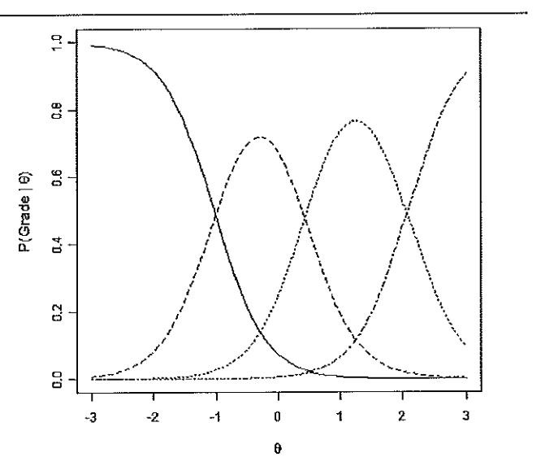

Figure 4. A typical set of item characteristic curves for NCEA external assessments constructed using Samejima's Graded Response Model (1969). The variable  $\theta$  represents the measurement scale on which candidate ability and item difficulty are estimated.

grade. In this two-parameter item characteristic curve, and in equivalent plots later in this paper, the curve to the far left of the plot represents the probability of attaining a Not Achieved grade, and, moving left-to-right, the remaining curves represent the probabilities of attaining Achieved, Merit, and Excellence, respectively.

In implementing these models, we assume that we can characterise a candidate's performance with a single dimension. Of course, no examination actually measures just one cognitive construct, but often the skills or knowledge that we wish to measure are sufficiently strongly correlated that, statistically, they can be treated as representing a single dimension.

Figure 5 shows item response curves pertaining to the four items of the 2010 examination for the Level 2 Chemistry standard 90308 (Describe the nature of structure and bonding in different substances).

All four items discriminate well (as shown by the relatively steep slopes of the item characteristic curves), but items 1 and 3 discriminate the best of the four. For each item we see that there is a clearly defined domain of ability for which each grade is the most probable grade.

#### **Grade thresholds**

The threshold values for Achieved, Merit, and Excellence are defined as those locations on the ability axis at which results of Achieved and Not Achieved, Merit and Achieved, and Excellence and Merit, are, respectively, equally probable. Usually, we plot thresholds (values of  $\theta_{\scriptscriptstyle MA}$ ,  $\theta_{\scriptscriptstyle AA}$ , and  $\theta_{\scriptscriptstyle AE}$ ) on a dot chart, a particularly effective way of depicting grade thresholds. Figure 6 shows the threshold plot the four items of the 2010 examination for the Level 2 Chemistry standard 90308 (Describe the nature of structure and bonding in different substances)

In this example none of the items are either particularly difficult or particularly easy. Additionally, the thresholds are reasonably (though not highly) consistent across the four items. There is no overlap between the domain in which the four Achieved thresholds fall, and that of the Merit grade. However,

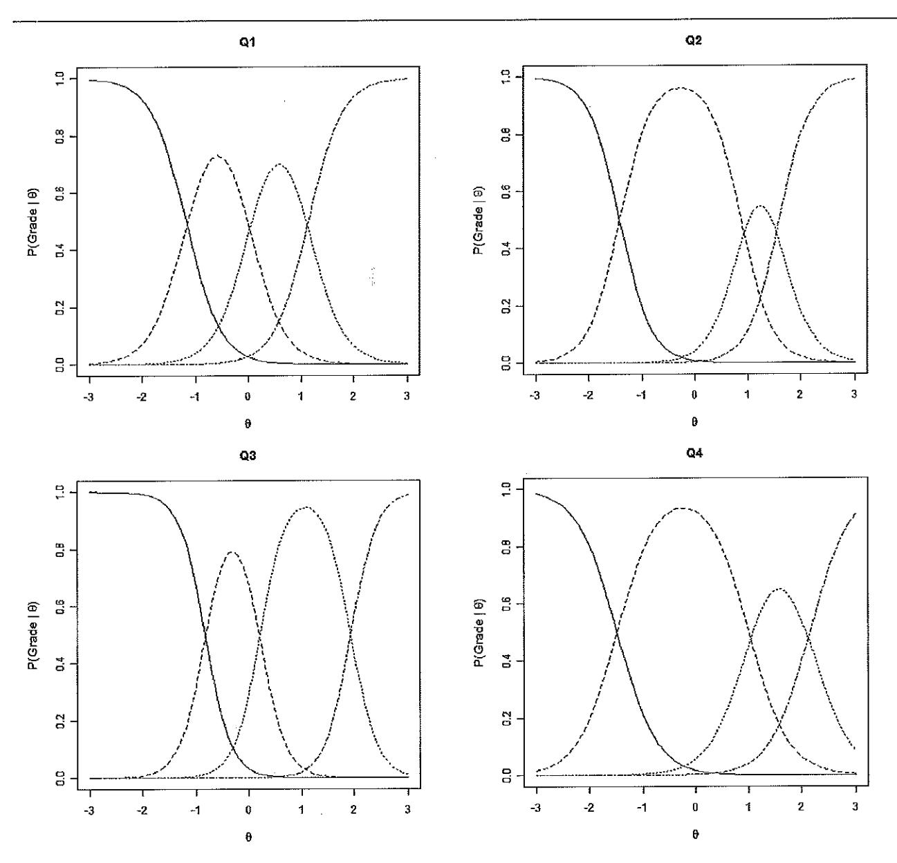

Figure 5. Item characteristic curves for the four items of the 2010 Level 2 Chemistry 90308 examination. From left to right the four curves represent the Not Achieved grade, the Achieved grade, the Merit grade and the Excellence grade. The variable  $\theta$  represents the measurement scale on which candidate ability and item difficulty are estimated.

the Merit domain does overlap slightly with the Excellence domain; not a desirable property, although, in this case the overlap is not substantial.

## Identifying item bias (differential item functioning)

Item bias, or differential item functioning (DIF), occurs when two or more groups of test or examination candidates, matched for overall ability, behave or perform differently on a particular item. We conduct DIF analysis in order to identify items that are possibly biased in favour of, or against, particular demographic groups (e.g. male or female candidates, or candidates identifying with different ethnic groups). Possibly, their different responses arise, not because one group of candidates has less knowledge of the subject matter, but because they held different assumptions initially or have had different cultural or other experiences.

During 2010 we developed analytic procedures for identifying DIF in NCEA assessments, based on those identified in the literature (e.g. Zumbo 1999; 2007). We fit a series of ordinal logistic regression models to the results of groups of candidates that are matched for ability (e.g. males and females or students of different ethnicities). First, we fit a base ordinal logistic regression model (i.e. no covariates) to the set of item responses, then a regression with one covariate (e.g. group membership or gender). Finally, we fit more sophisticated models that include an interaction term (i.e. between ability and group membership or gender). These models are used to predict the item responses, where the main predictors are group membership and ability. For each model we calculate diagnostic statistics such as the log-likelihood and a Chi-square value (the log-likelihood for the base model minus the log-likelihood for each of the more complex models). Finally, the Chi-squared change for these models yields diagnostic statistics (i.e. the p-value and the Rsquared change) which identify DIF. We detect the presence of DIF when the p-value is less than 0.05 and the R-squared change is greater than or equal to  $0.035$ .

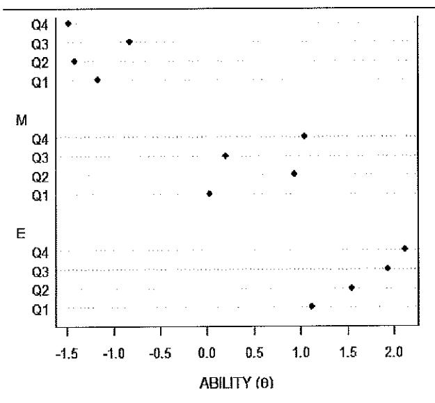

Figure 6. Grade thresholds for the four items (Q1-Q4) of the 2010 Chemistry 90308 examination. Thresholds represent the points on the measurement scale at which adjacent categories are equally probable.

We may observe either uniform or non-uniform DIF. We have uniform DIF when one group has a higher probability of success on an item across the full range of abilities. We have non-uniform DIF when one group has a higher probability of success on an item on one or more domain of abilities, but has a lower probability on other domains. Our models produce output such as that of Table 4, pertaining to item 1 of the 2010 examination for the Geography standard 90704 (Select and apply skills and ideas in a geographic context).

The above item involved identifying particular geographic features on a satellite image and answering various questions that involved map reading skills. We see that this item exhibited uniform DIF between males and females (i.e. group membership was a significant predictor), but not between the ethnic-

ity-based groups. Precisely why the item favoured males is not clear, but subject matter experts can often assist in such questions. It is important to note that the presence of DIF does not in itself establish bias. Bias is only established when the differential functioning is invalid in respect of the test construct, and the professional judgement of subject-matter experts is required to make this determination.

We can depict graphically the presence or otherwise of DIF. Figure 7 illustrates the presence of uniform DIF between male and female candidates for the above item. Note that the probability of success in the item is greater for male candidates than for female candidates across the entire ability domain.

To illustrate DIF we group the ability scores of all candidates in a set number of bins (here we use 12 bins, each of width 0.5 logits). We then plot

Figure 7. Graphical depiction of Differential Item Functioning for item 1 from the 2010 Geography standard 90704.

| Table 4. Results of an analysis of Differential Item     |  |  |  |  |
|----------------------------------------------------------|--|--|--|--|
| Functioning for item 1 from the 2010 examination for the |  |  |  |  |
| Level 3 Geography standard 90704.                        |  |  |  |  |

| <b>Comparison Groups</b> | Uniform | Non-uniform |  |  |
|--------------------------|---------|-------------|--|--|
| Male - Female            | Yes     | No          |  |  |
| European - Maori         | No      | No          |  |  |
| European - Pasifika      | No      | Nο          |  |  |
| European - Asian         | No      | No          |  |  |

cumulative proportions of each subgroup (in this case males and females) attaining Achieved, Merit or Excellence grades (and whose estimated abilities fall within each bin), against the mean ability for each bin. For this particular item, across the entire domain of abilities, males were more successful than females. Nonetheless, our analyses of the results distributions of recent (i.e. the 2009 and 2010) examinations across many subjects and standards has revealed very little evidence of DIF.

## New Zealand Scholarship: A hybrid of standards-based and normative assessment

New Zealand Scholarship examinations are designed to recognise high-level performance in a range of subjects (currently 35 subjects). Two passing grades are available for each subject: Scholarship and Outstanding Scholarship.

Results are awarded through a hybrid of normative assessment (in which candidates' grades depend on their performances relative to those of other candidates) and crierion-referenced assessment (in which candidates must satisfy established criteria for each available grade). In assessing candidates' scripts, each item is given a numerical (ordinal) score from 0 to 8, and the scores for individual items summed to produce an overall score for the script. Scores from  $0 - 4$  equate to a *No Award* grade; scores of 5 and 6 equate to a Scholarship grade, while scores of 7 and 8 equate to an Outstanding Scholarship grade.

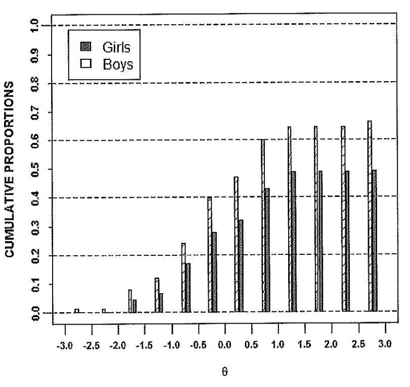

Finally, a pair of cut scores, which define the range of total scores for award of Scholarship and Outstanding Scholarship for each script, is agreed. These cut scores are set so that about 3% of the NCEA Level 3 cohort, defined as the total number of candidates who have entered for 14 or more credits for NCEA Level 3 in that subject (not to be confused with the total number of students who have entered for the examination, which is usually a much smaller number), will receive a Scholarship, and about 0.4% will receive an Outstanding Scholarship. This is the normative part of the Scholarship assessment process.

Each script must include at least one item at Scholarship level if a Scholarship is to be awarded, and each script must include at least one item at Outstanding Scholarship level if an Outstanding Scholarship is to be awarded. If a script contains at least one item graded at 5 or 6, then we can say that the candidate has provided evidence of performance at Scholarship level, and similarly for Outstanding Scholarship level. This is the criterion-referenced part of the Scholarship assessment process.

#### **Awarding New Zealand Scholarship**

Let us consider the 2010 Scholarship examination in Physics. This examination involved six items, so that the maximum possible score was 48. Following completion of the marking process, the cut score for Scholarship Physics was agreed at 25 (i.e. roughly 3% of the Physics Level 3 cohort) and the cut score for Outstanding Scholarship was set at 35 (roughly 0.4% of the cohort). Figure 8 gives a bar chart of total scores for the six-item 2010 Scholarship examination in Physics. The vertical lines indicate the cut scores for Scholarship (S) and Outstanding Scholarship (O) awards in that subject.

The bar chart shows a very wide range of performances on this examination. The Scholarship cut score of 25 was chosen so that roughly 3% of the cohort earned that score or above, all candidates at this score or above receiving at least one score of 5 over the complement of six items. The Outstanding Scholarship cut score of 35 was chosen so that roughly 0.4% of the cohort

earned that score or above, all candidates at this score or above earning at least one score of 7.

The bar chart shows a highly skewed distribution of scores, a desirable characteristic in an examination that is designed to challenge top students. The positively-skewed distribution indicates that the test provides the most reliable information in the region of performance in which cut scores are likely to be set; around the midpoint of the total-score range for the Scholarship cut, and the threequarters point for the Outstanding Scholarship cut.

Figure 8. Bar chart of total scores for the 2010 NZ Scholarship Physics examination, with Scholarship and Outstanding Scholarship cut scores (25 and 35 respectively).

#### Statistical modelling of New Zealand Scholarship

For all New Zealand Scholarship examinations we conduct similar analyses to those conducted for NCEA; dimensional analysis, IRT, etc, although the scholarship analyses are implemented on the full set of results, rather than on a sample. However, one additional analysis involves characterising the relationship between the results attained by Scholarship candidates in NCEA Level 3 in a given subject and their results in the Scholarship examination. Figure 9 gives a scatter-plot relating candidates' performances in the Level 3 Physics standards against their performances in Scholarship Physics. The vertical axis gives the mean expected percentiles (a measure of performance expressed as the expected percentile of the Level 3 candidature earned by the 'typical' candidate who has earned a particular grade in one of the external assessments) for each of the Level 3 Physics assessments taken by each candidate. The horizontal axis gives the total score earned by each candidate in the 2010 Scholarship Physics examination.

What exactly is a mean expected percentile? Let's illustrate using the Level 3 Physics examination for the four-credit Level 3 standard 90520 (Demonstrate understanding of wave systems). The national grade distribution for this examination was as follows: Not Achieved (24.0%), Achieved (54.5%), Merit (15.4%) and *Excellence* (6.2%). In the absence of precise information about any given student, our best estimate is that a student earning a *Not Achieved* grade sits at 12% of the candidature from the lowest score (i.e. the 12th percentile). Our best estimate is that a student earning an Achieved grade sits at 24% plus half of 54.5% (or the 51st percentile) from the lowest scoring candidate. Similarly, our best estimate is that a student earning a Merit grade sits at the 86th percentile, and a student earning an Excellence grade sits at the 97th percentile. Of course, each Scholarship candidate who took NCEA (some take other assessments such as Cambridge International Examinations or the International Baccalaureate) will have gained a particular set

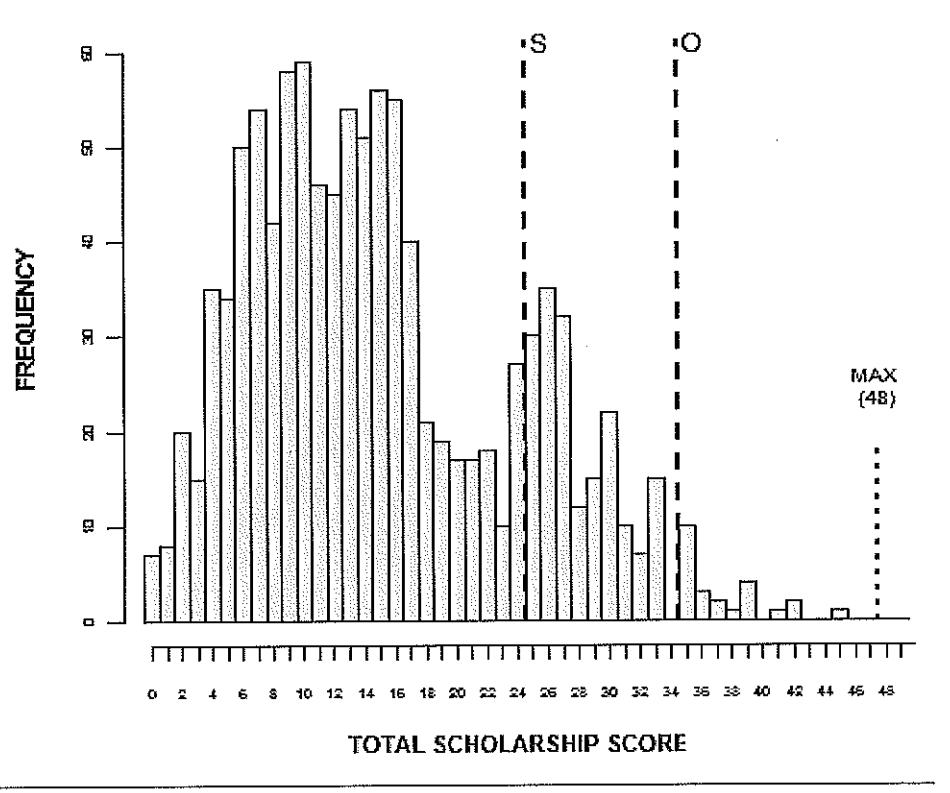

New Zealand Science Review Vol 68 (4) 2011

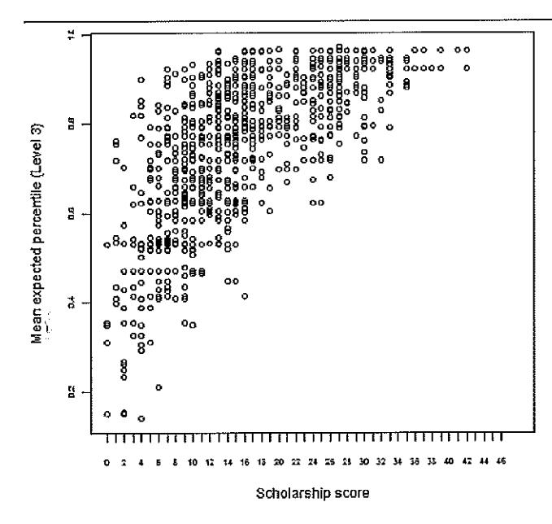

Figure 9. A plot of the mean expected percentiles for the 2010 Level 3 results for all Scholarship candidates in Physics against their total scores for the 2010 NZ Scholarship Physics examination.

of results in one or more of the four Level 3 Physics standards, and each is accorded a mean expected percentile for each of his or her Level 3 assessments. It is these percentiles, expressed as decimals, that are recorded on the vertical axis of Figure 9.

Essentially, this analysis illustrates the power of NCEA Level 3 in predicting performance in New Zealand Scholarship. In general terms the greater the mean expected percentile of the Level 3 assessments, the greater is the total Scholarship score. The relationship appears to be almost linear up to a Scholarship score of about 16, after which the curve levels off somewhat.

Figure 9 illustrates a particularly desirable attribute of a Scholarship examination: it extends the top end of performance of the Level 3 cohort. Students scoring in the top half of the Scholarship range typically achieve results at *Merit* and *Excel*lence at Level 3. The examination has displayed discriminative power at higher levels of candidate performance than the Level 3 examinations.

## **Summary**

Statistical modelling of NCEA and New Zealand Scholarship results provides very valuable feedback that supports ongoing improvement of our assessment processes. In addition to the

analyses described in this paper, we undertake many other diagnostic analyses that help to ensure fair and consistent assessment. Further applications of IRT are anticipated for the future. Eventually, our modelling programme will support the creation of banks of strongly-performing items for use by examiners and teachers, and in which we can have a very high degree of confidence.

It is important to be clear that the programme of analysis presented here is statistical in nature and concentrates on properties internal to the assessments themselves. The analyses we have described are necessary to ensure that assessments measure reliably, efficiently and fairly. They are not, however, of themselves sufficient to ensure valid measurement. Validity is the most essential property of any assessment and requires substantial content knowledge and understanding of the purposes of the assessment. Nonetheless, an assessment without strong reliability or that is of inappropriate difficulty, will not be valid, regardless of its specific content. Thus, the analyses described in this paper are essential for ensuring fair, reliable and valid national assessments for secondary-school qualifications in New Zealand.

## **References**

- Cattell, R.B. 1966. The scree test for the number of factors. Multivariate Behavioral Research 1: 629-637.
- Cronbach, L.J. 1951. Coefficient alpha and the internal structure of tests. Psychometrika 16(3): 297-334.
- Hambleton, R.K., Swaminathan, H.; Rogers, H.J. 1991. Fundamentals of Item Response Theory. Newbury Park, California, Sage Publications. ISBN 0-8039-3647-8.
- Kaiser, H.F. 1960. The application of electronic computers to factor analysis. Educational and Psychological Measurement 20:  $141 - 151.$
- Pearson, K. 1901. On lines and planes of closest fit to systems of points in space. Philosophical Magazine 2 (6): 559-572. http://stat.smmu. edu.cn/history/pearson1901.pdf.
- Samejima, F. 1969. Estimation of latent ability using a response pattern of graded scores. Psychometric Monograph No. 17, Psychometric Society, Richmond, Virginia.
- Zumbo, B.D. 1999. A Handbook on the Theory and Methods of Differential Item Functioning (DIF): Logistic regression modelling as a unitary framework for binary and Likert-type (ordinal) item scores. Ottawa, Directorate of Human Resources Research and Evaluation, Department of National Defense. Retrieved from http://educ.ubc.ca/faculty/zumbo/DIF/handbook.pdf
- Zumbo, B.D. 2007. Three generations of DIF analyses: Considering where it has been, where it is now, and where it is going. Language Assessment Quarterly 4(2): 223-233.

## **Acknowledgments**

The authors wish to acknowledge the valuable contribution of Vernon Mogol to the work described in this paper, particularly in relation to Differential Item Functioning.

## **SPER**

# **FS1057**

**Functional** Specification

## **ITARS and Related Calculations**

Version: 2.1 **Status: DRAFT** 

## **Document History**

| <b>Document Revision History</b>                                                                                                                             | <b>Version</b> | <b>Date</b> | <b>Author</b> |
|--------------------------------------------------------------------------------------------------------------------------------------------------------------|----------------|-------------|---------------|
| Initial draft based on older documentation                                                                                                                   | 0 1 | 17 Nov 2010 | David Coxon   |
| First draft updated to the Australian Tertiary Admission Ranking System (ATARS), the replacement for the Australian Interstate Transfer Indices (ITI). | 02             | 1 Jul 2012  | David Coxon   |
| Revised and tidied up following feedback Split into the ITARS calculation and the ATARS derivation from the <b>ITARS.</b>                              | 03             | 9 Oct 2012  | David Coxon   |
| FINAL for 2012                                                                                                                                               | 1.0            | 12 Oct 2012 | David Coxon   |
| Add the definition of the rate of success in Standard Difficulty equation.                                                                                | 1 0 1          | 6 Nov 2012  | David Coxon   |
| Include rules for saving recalculated ITAR and ATAR scopes on <b>LEARNER_STATISTIC</b>                                                                    | 20             | 28 Nov 2012 | David Coxon   |
| Update to include removal of 2-year limit for ATARS in 2017 and review to identify potential changes upon closure of IQ15                                 | 21             | 30 Sep 2022 | David Wilson  |

## **Document References**

### **Related Documents**

FS1056 Highest Attainment

FS1794 Australian Tertiary Entrance Verification for Providers

### **Confidentiality**

This document is for the sole and exclusive use of NZQA. The information contained in this document is confidential. It shall not be disclosed outside NZQA and shall not be duplicated, used or disclosed in whole or in part without the express written consent of NZQA.

# **Contents**

| $\mathbf{1}$ .     |                                  | <u> Introduction</u>                               |  |  |  |  |
|--------------------|----------------------------------|----------------------------------------------------|--|--|--|--|
| 1.1                |                                  | Overview                                           |  |  |  |  |
| 1.2                |                                  | Document Purpose                                   |  |  |  |  |
| 1.3                | Document Audience                |                                                    |  |  |  |  |
| 1.4                |                                  | Functional Specification Context                   |  |  |  |  |
| 2.                 |                                  | Functional Specification Profile                   |  |  |  |  |
| 3.                 |                                  | Definition of Terms                                |  |  |  |  |
| 4.                 | Eligibility                      |                                                    |  |  |  |  |
| 4.1                | ITARS and SSP-eligible standards |                                                    |  |  |  |  |
| 4.2                | ITARS and SSP-eligible results   |                                                    |  |  |  |  |
| 5.                 | ITARS Processes                  |                                                    |  |  |  |  |
| 5.1 ldeal State |                                  |                                                    |  |  |  |  |
|                    | 5.1.1                            | Calculation Approach                               |  |  |  |  |
|                    | 5.1.2                            | Determine the Percentage Scores                    |  |  |  |  |
|                    | 5.1.3                            | Determine Standard-Difficulty Adjustment           |  |  |  |  |
|                    | 5.1.4                            | Determine List of Candidates                       |  |  |  |  |
|                    | 5.1.5                            | Determine Scores and Ranking by Subject (SSP)      |  |  |  |  |
|                    | 5.1.6                            | Determine Overall Score and Ranking                |  |  |  |  |
| $5.2^{\circ}$      |                                  | Differences                                        |  |  |  |  |
|                    | 5.2.1                            | Determine Scores and Ranking by Subject (5.1.5)    |  |  |  |  |
| 5.3                |                                  | Storage                                            |  |  |  |  |
| 6.                 |                                  | Australian Variation                               |  |  |  |  |
| 6.1                |                                  | Subject Groups                                     |  |  |  |  |
| 6.2                |                                  | Determine Cohort Participation Rate and ATAR Score |  |  |  |  |
| 6.3                | Daily ATARS Update               |                                                    |  |  |  |  |
| 7.                 |                                  | German Variation                                   |  |  |  |  |
| 7.1                |                                  | Subject Groups                                     |  |  |  |  |
| 7.2                |                                  | German Rating                                      |  |  |  |  |
| 7.3                |                                  | German Overseas Results Notice                     |  |  |  |  |
| 8.                 |                                  | Output Files                                       |  |  |  |  |

## **Authorship**

| <b>Author: David Coxon</b>                                                                                                                    |       |  |  |
|-----------------------------------------------------------------------------------------------------------------------------------------------|-------|--|--|
| I confirm that I have consulted all interested stakeholders in producing this document and have reflected all the requirements known to me |       |  |  |
| Signed:                                                                                                                                       | Date: |  |  |
| <b>Peer Reviewer:</b>                                                                                                                         |       |  |  |
| I confirm that I have peer reviewed this document and have validated the quality of the analysis it contains                                  |       |  |  |
| Signed:                                                                                                                                       | Date: |  |  |

## **Ownership**

| <b>IS Management:</b>                                                                                                                                                  |       |  |  |  |
|------------------------------------------------------------------------------------------------------------------------------------------------------------------------|-------|--|--|--|
| I confirm that this specification conforms to the requirements of the NZQA IS SDLC and is fit for the purposes of systems design, development, testing and support. |       |  |  |  |
| Signed:                                                                                                                                                                | Date: |  |  |  |
| <b>Business Owner:</b>                                                                                                                                                 |       |  |  |  |
| I confirm that the functionality set out in this specification accurately and completely represent the strategic and business requirements of my business unit.     |       |  |  |  |
| Signed:                                                                                                                                                                | Date: |  |  |  |

#### 1. **Introduction**

#### $1.1$ **Overview**

In early January each year NZQA runs a full QUALCHECK and award process.

A number of attainment and ranking processes are than run to provide input to other extracts for schools and tertiary providers:

- Highest Attainment Calculation (HAC) run January through to May(ish). (See FS1056 **Highest Attainment)**
- International Tertiary Admission Ranking System (ITARS) followed by a derivation of the ITARS to provide the Australian ATARS, currently these two steps are performed simultaneously. This is the replacement for the Australian Interstate Transfer Indices (ITI). It is run in January then daily updates to May(ish). This is used in creating the Australian TEVP files (see FS1794 -Australian Tertiary Entrance Verification).
- International Tertiary Admission Ranking System (ITARS) followed by a derivation of the ITARS to provide the German results (GTARS). This is run in January then daily updates to May(ish). It is used by overseas learners wanting a German overseas Results Notice (ORN) (see FS499). Note: while the same ITARS process is used for both ATARS and GTARS, the subject groups differ, meaning that some parts of the process need to be re-run.

There is also a static annual value used for GTARS, described as NMin and NMax, calculated at the time of the ITARS run in early January

There is also a Thai ORN, however this is not based on the ITARS framework (see FS498).

#### $1.2$ **Document Purpose**

The objective of this document is to give and overview of how the ITARS is generated and the ATARS and GTARS results stored.

#### $13$ **Document Audience**

The primary audience for this document is subject matter experts (SME) who will be using the final system, and IS analysis, development and testing staff.

It is intended that the FS documents will provide sufficient description of the calculation to be used for on-going defect analysis and application support.

#### **Functional Specification Context** $1.4$

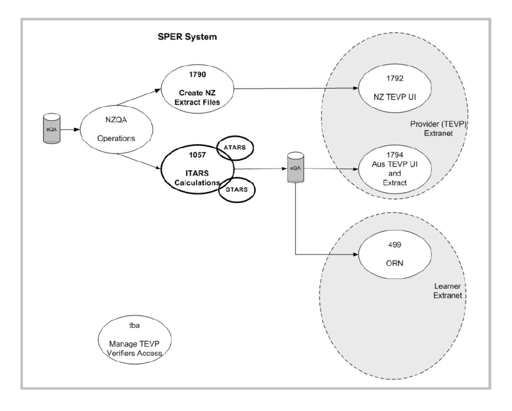

### **Functional Specification Profile** $2.$

| <b>Functional Specification Profile</b> |                                                                                                                                                                                                |  |  |  |  |  |
|-----------------------------------------|------------------------------------------------------------------------------------------------------------------------------------------------------------------------------------------------|--|--|--|--|--|
| <b>Description</b>                      | This functional specification describes the ITARS and related calculations.                                                                                                                    |  |  |  |  |  |
| <b>Typical User</b> <b>Roles</b>     | Operations: Run the process                                                                                                                                                                    |  |  |  |  |  |
| <b>Triggers</b>                         | Post Exams QualChecking complete                                                                                                                                                               |  |  |  |  |  |
| <b>Pre-Conditions</b>                   | All bulk exam results have been received and/or the results return cut-off date has been reached.                                                                                           |  |  |  |  |  |
|                                         | For the initial (January) processing, sufficient results have been received. Data and Data Analysis will notify when this has been achieved.                                                |  |  |  |  |  |
|                                         | For subsequent update processes, new results have been received.                                                                                                                               |  |  |  |  |  |
|                                         | All Candidates have had the appropriate QualCheck completed and the correct qualifications have been recorded.                                                                              |  |  |  |  |  |
| <b>Post-Conditions</b>                  | The ATARS result is held for all year 12 and 13 students with 60+ credits (N,A,M,E results) at L3+ (including tertiary results) in academic years where there was a secondary enrolment. |  |  |  |  |  |

#### **Definition of Terms** $3.$

The following specialist terms and abbreviations are used in this document:

| <b>Term</b>  | <b>Definition</b>                                                                          |
|--------------|--------------------------------------------------------------------------------------------|
| <b>ATARS</b> | Australian version of ITARS. Differences cover in section 6.2                              |
| <b>ITARS</b> | International Tertiary Admission Ranking System Also refers to the overall score gained |
| <b>GTARS</b> | German version of ITARS. Differences cover in section                                      |
| <b>SSP</b>   | <b>Subject Summary Percentile</b>                                                          |

#### $\overline{\mathbf{4}}$ . **Eligibility**

#### $4.1$ **ITARS and SSP-eligible standards**

- All standards registered at Level 3 on the National Qualifications Framework with at least one secondary school entry are eligible for inclusion in the ITARS calculation.
- Although ITARS eligible credits need not be drawn from UE approved subject areas, the ITARS calculation for each candidate will use results from UE approved subject areas in preference to results not from UE approved subject areas; that is results not from UE approved subject areas will only be used for candidates with fewer than 90 credits of assessed entries in UE approved subject areas. The order of selection priority is:
  - $\circ$ UE achievement then
  - $\alpha$ UF unit standard then
  - Non-UE achievement then  $\sim$
  - Non-UE unit standard.  $\circ$
- No more than 90 credits may be included in the ITARS calculation. When the final result needed takes a candidate's total over 90 credits, the calculation will pro rata the contribution of the lowest standard.
- No more than 24 credits may be included in the ITARS calculation for any one UE subject. When the final result needed takes a candidate's total over 24 credits, the calculation will pro rata the contribution of the lowest standard.
- Where multiple results occur in the same standard only the best result is used, all other duplicates are removed

#### $4.2$ **ITARS and SSP-eligible results**

- A student is an ITARS candidate if they:
  - have 60 or more level 3+ credits with N.A.M.E results gained in the last two vears  $\circ$
  - are in year 12 or 13 in the calculation year.  $\sim$
- The expected percentiles and standard difficulty adjustments are calculated each year, based on that year's distributions of results. It is assumed that only the one current version of a standard is used in a single year.
- When results from the previous year are used, standard metrics (credits, level) and the expected percentiles and standard difficulty adjustments must be determined based on the distribution of results for the year in which they were obtained. This implies that the appropriate version of the standard for the year where the result was gained must be used.

#### $51$ **ITARS Processes**

This section describes the ideal ITARS calculation process in the context of the NCEA / UE environment.

The following section describes the current, limited implementation and the additional processing required for ATARS.

#### $5.1$ **Ideal State**

#### $5.1.1$ **Calculation Approach**

The key steps in the ITARS calculation process are:

- $11$ Determine percentage scores
- $2.$ Determine Standard-Difficulty adjustment
- $\overline{3}$ Determine eligible candidates
- $\overline{4}$ . Determine subject scores and rankings.
- 5 Determine Cohort Participation Rate and ATAR Score

#### $5.1.2$ **Determine the Percentage Scores**

This step is to determine an equivalent percentage score for each grade category (N,A,M,E) for every standard eligible to count towards the ITARS.

This is calculated as part of the initial processing in January, using all secondary results for this year, not just those of ITARS students. Note that the mid-points are not recalculated as part of the update process when new results are received for individual candidates.

An eligible standard is any L3 standard which is used for at least one secondary school entry this year.

Graphically equivalent percentage scores can be shown by the red arrows on the diagram below:

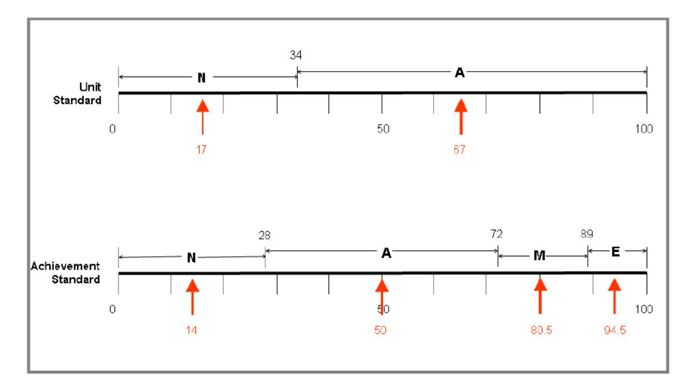

## **Explanation**

## **Unit Standards**

The diagram show a unit standard (U/S) where, based on actual results, 34% of candidates scored 'N' and 66% gained 'A".

For 'N' the mid-point or 'expected' score is half way along the grade  $(34\%/2) = 17\% (0.17)$ . Likewise the mid point of the 'A" grade is halfway between  $34\%$  and  $100\% = 67\%$  (0.67).

## **Achievement Standards**

Achievement standards (A/S) follow the same pattern as for U/S, but with all four grade categories.

#### $5.1.3$ **Determine Standard-Difficulty Adjustment**

The next step is to determine an adjustment factor to reflect the relative difficulty of each standard. based on this year's results. This allows a fair comparison between students in calculating the ITARS score irrespective of the difficulty of the standards undertaken by each students.

This is done by comparing the performance of candidates taking the standard being assessed for difficulty (the target standard  $S_i$ ) with their performance on each other standard  $(S_i)$ . For example if, of the 1000 candidates taking standard Si 50 are also taking the standard Si, then the relative performance of these 50 candidates on  $S_i$  and  $S_i$  is measured. This assessment is done for the subset of candidates taking each pair of standards, using the formula:

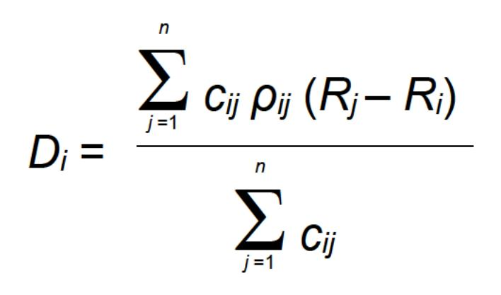

Where:

 $D_i$  = difficulty of standard  $S_i$ 

 $C_{ii}$  = the number of candidates taking both  $S_i$  and  $S_i$ 

- $R_i$  = the rate of success of  $C_{ij}$  in  $S_i$
- $R_i$  = the rate of success of  $C_{ii}$  in  $S_i$
- $N =$  the total number of standards with cohorts that overlap that of S
- $\rho_{ij}$  = the magnitude of the non-parametric correlation (Spearman's  $\rho$ ) between standards i and j.

The rate of success  $(R_i)$  is the percentage of successful candidates  $(C_{ii})$  for the standard expressed as a decimal.

The correlation in rate of success  $(p)$  gives a measure of the extent to which performance in a pair of standards draws upon similar knowledge, skills, or cognitive functions. A correlation coefficient of one means that performance on one standards would be completely predictable from performance on the other, while a correlation coefficient of zero would mean that performance on one standards would provide no indication of performance on the other.

pij is calculated as:

sum [(si.ResultNum - sc.i\_ResultMean)\*(sj.ResultNum - sc.j\_ResultMean)]

√{ [sum(si.ResultNum - sc.i ResultMean, 2)\*\*2] \*[sum(sj.ResultNum - sc.j ResultMean\*\*2]}

for every pair of i, i standard results for every learner who has results in both i and i

Where  $si$ . Result Num =

 $si$ . ResultNum =

sc.i ResultMean =  $[(3 * i E) + (2 * i M) + i A]/SharedCohortSize$ 

sc.j ResultMean =  $[(3 * i E) + (2 * i M) + i A]/\frac{S}{S}$ haredCohortSize

SharedCohortSize = number of students who have results in both standards i and j.

Different standards may have a different number of passing grades, i.e. A/S usually have three passing grades (A, M, E) and a U/S will typically only have one. A difficulty measure is calculated for each passing grade: e.g. the relative difficulties of obtaining a result of A or better. M or better, and E for the standard.

Once the difficulty of a standard has been estimated, the proportion the value of the estimate. D. reflecting the A result (and excluding the M and E proportion) is added to the expected percentile for that standard to adjust for the difficulty (when the estimated difficulty is less than average, the value of D will be negative, and the expected percentile score will be reduced appropriately).

The percentile 'Di' is stored for all standards (i) and grades for each year. A distinction does not need to be made between versions of a standard.

## Notes:

- The average differences in rates of success are in weighted averages, with the values of the weights determined by the relative sizes of the overlapping cohorts, and by the strength of the correlation in performance. This places more emphasis on comparisons involving standards with larger common cohorts; this is appropriate because the greater the size of the overlap, the more reliable the comparison.
- The correlation in rate of success gives a measure of the extent to which performance in a pair of standards draws upon similar knowledge, skills, or cognitive functions. Clearly, if performance in two standards is uncorrelated (i.e., if the value of the correlation coefficient is zero), then the question of their relative difficulty does not make sense. On the other hand, if performance was completely correlated (i.e., the value of the correlation coefficient is one), then performance on one would be completely predictable from performance on the other, and they would be fully comparable in terms of their relative difficulty. In practice, correlations are never as great as one, and although the theoretical minimum correlation is negative one (a negative correlation indicating an inverse relationship in performance), a correlation in performance on a pair of standards as low as zero is very rarely, if ever, observed.
- If a percentage is adjusted to greater than 1.0 it is capped at 1.0, if below 0.0 it is capped at 0.0.
- This calculation does not use the percentage scores calculated in 5.1.2.

#### $514$ Determine List of Candidates

All candidates at level 12 or 13 who have 60 or more Level 3 credits with N,A,M,E results over the last 2 years are eligible for an ITARS ranking (ie a year 12 candidate with 60 L3 N.A.M.E results over the last 2 years would also be eligible).

#### $5.1.5$ Determine Scores and Ranking by Subject (SSP)

As per 5.2.1 below, this process is not currently implemented and is not needed for the 2012. academic year. It is uncertain if it will be used in the future.

This is based on a specified subject grouping and on all relevant standards, regardless of paid status. Different subject groups may be used by different countries. See the following sections for specific subject groups details.

For each subject, a full year's study is deemed to be 18 credits, and a candidate needs to have a minimum of 18 CR of N.A.M.E results available in a subject before they can be ranked for that subject.

A candidates Subject Summary Percentile (SSP) score is calculated based on their highest priority 18 N.A.M.E results in that subject. The priority order for standards in the subject is:

- Standard type  $\mathbf 1$ 
  - UE achievement then  $\circ$
  - UE unit standard then  $\sim$
  - Non-UE achievement then  $\Omega$
  - Non-UE unit standard.  $\Omega$
- $2.$ Descending order of average expected percentiles (highest first) within standard type.

If the result that takes the total to 18 credits in fact causes the total to exceed 18, pro-rata the credit value of the final standard.

In the following table, showing one subject, with A/S a to g giving the candidate a total of 24 credits. By ranking the standards as described above only the first six standards need to be used to exceed 18 CR.

The candidate's weighted average score is therefore the sum of (Cr \* PS) for the credits used from the six standards divided by the number of credits used (18).

Candidates are ranked by their SSP for each subject in which they are eligible.

Note: in selecting the standards that are part of the subject, exclusions first need to be applied as follows:

- $11$ If multiple results in a single standard, choose the best result by percentile.
- $\overline{2}$ If an exclusion pair exists between A/S and U/S then choose the A/S over the U/S.
- $3l$ If an exclusion pair exists between A/S and A/S or U/S and U/S then choose the best result by percentile

This approach does not always correctly handle situations where the two exclusion standards are in different subjects, although it is assumed that that situation would be unlikely to occur.

| <b>Standard</b>       | <b>Credits</b> <b>Available</b> | <b>Credits</b> | <b>Used Grade</b> | <b>Percentile</b> <b>Score (Di)</b> | $Cr * PS$ |
|-----------------------|------------------------------------|----------------|-------------------|----------------------------------------|-----------|
| Standard f            | 3                                  | 3              | E                 | 0.932                                  | 2.796     |
| Standard b            | 3                                  | 3              | М                 | 0.792                                  | 2.376     |
| Standard d            | 3                                  | 3              | Α                 | 0.627                                  | 1.881     |
| Standard e            | 4                                  | 4              | A                 | 0.551                                  | 2.204     |
| Standard a            | 4                                  | $\overline{A}$ | A                 | 0.513                                  | 2.052     |
| Standard g            | 4                                  | 1              | A                 | 0.441                                  | 0.441     |
| Standard c            | 3                                  | $\overline{0}$ | N                 | 0.121                                  | n/a       |
|                       | 24                                 | 18             |                   |                                        | 11.75     |
| <b>Subject Score:</b> |                                    |                |                   |                                        | 0.653     |

#### $5.1.6$ **Determine Overall Score and Ranking**

In addition to a score and hence ranking by subject, candidates are given an overall score and ranking.

Because the ITARS is based on a rank ordering of all candidates with Level 3 results, the ranking calculation must be carried out for all candidates with 60 or more credits of N.A.M.E results L3+ results in the last 2 years who are currently in years 12 or 13.

For each candidate with a L3 results, the highest priority 90 credits worth of standards are identified. The priority order for standards is:

- $\mathbf{1}$ . **Standard type** 
  - UE achievement then  $\circ$
  - UF unit standard then  $\sim$
  - Non-UE achievement then  $\Omega$
  - Non-UF unit standard  $\Omega$
- $21$ Descending order of average expected percentiles (highest first) within standard type.

Note: in selecting the standards, exclusions first need to be applied as follows:

- If multiple results in a single standard, choose the best result by percentile.  $11$
- If an exclusion pair exists between A/S and U/S then choose the A/S over the U/S.  $2.$
- $3l$ If an exclusion pair exists between A/S and A/S or U/S and U/S then choose the best result by percentile.

Once contributing results have been determined, the ITARS is calculated in the same way as SSP. If the total number of eligible results for a candidate's ITARS is less than 90, the denominator for the credit-weighted average is nonetheless 90. If the final (lowest valued) result used to determine the ITARS takes the total to more than 90 credits, the lowest result is pro-rata-ed and denominator remains 90 credits

When credit-weighted totals have been determined for all eligible candidates, the scores are ranked, and a percentile ranking is assigned to each. This percentile ranking is the ITARS.

The ITARS percentile is then used to determine the ATARS score as described in the following steps.

#### $5.2$ **Differences**

#### $5.2.1$ Determine Scores and Ranking by Subject (5.1.5)

The ITARS process is not used. Rather, the old process that was used in parallel with the ITI process is still used.

The grade average is calculated as follows:

For each entry, calculate WeightedEntryCredits = EntryCredits X ResultWeighting Where ResultWeighting is defined as:

N  $\overline{a}$ 1  $\overline{2}$ A  $\equiv$ 3 M  $\equiv$ F  $\overline{A}$  $\equiv$ 

Calculate:

WeightedEntryCreditsSum = SUM (WeightedEntryCredits) and: EntryCreditsSum = SUM (EntryCredits)

Calculate:

GradeAverage = WeightedEntryCreditsSum / EntryCreditsSum

#### 5.3 **Storage**

The ITARS score is held in the LEARNER STATISTIC TABLE as a type 'IR' record, for the current academic vear.

If the ITARS calculation is repeated, new scores are added as follows

- If no score exists in LEARNER\_STATISTIC for the academic\_year, then create a record  $(\text{active} \text{ ind} = 1)$
- If a previous score exists for the same academic year. AND the new result is lower or the same, then do not create an entry (previous result remains)
- If a previous score exists for the same academic year, AND the new result is higher, then the previous result is set to inactive (active  $ind = 0$ ), and a new record is to be added to LEARNER STATISTIC (active  $ind = 1$ )

Values for the parameters Nmin and Nmax are calculated for the year and stored to be displayed by the German ORN (see FS499).

Nmin is the lowest ITAR score for the year, multiplied by 90.

Nmax is the highest ITAR score for the year, multiplied by 90.

These are derived as needed when generating the German ORN. See FS499 for further details.

#### **Australian Variation** 6.

#### $6.1$ **Subiect Groups**

Australia uses the NZQA UE Subject groups.

#### 62 **Determine Cohort Participation Rate and ATAR Score**

The participation rate compares the number of learners in this cohort that were in year 9 (first year of secondary) with the number now having at least 60 credits of L3 results gained in the last two secondary enrolments (years 12 and 13). This uses the StatsNZ data and the count of Year 13 learners entered in NZQF standards.

## The Participation Rate (Roll Adjustment Factor) =

(number of cohort with L3 results [as defined above]) / (cohort size in year 9 [4 yrs ago])

The final ATAR ranking needs to be in the context of the whole population.

The participation rate is used with a table of the ATAR score mapped to the ITARS percentile for different participation rates. This table is currently provided as a spreadsheet from the Australian Conference of Tertiary Admission Centres (ACTAC).

The ATARS score is held in the LEARNER STATISTIC TABLE as a type 'IP' record for the current academic year. See the Daily Update section below for details of subsequent updates to the scores.

### **Example**

For a Participation Rate of 48%  $\overline{A}$  $\overline{D}$  $DM$  $DN$  DO  $DK$ The top 0.108 percent of the list of candidates, ranked  $\mathbf{1}$ according to their ITARS scores, are assigned an ATAR score of 99.95  $\overline{2}$ 47.6 47.8 48.0 48.2 48.4  $\overline{3}$ IТI 99.95 0.108 0.108 0.108 0.107 0.107  $\overline{A}$ 5 99.90 0.108 0.108 0.108 0.107 0.107 The next 0.108 percent of candidates are assigned an ATAR score of 99.90  $\overline{6}$ 99.85 0.108 0.108 0.108 0.107 0.107  $\overline{7}$ 99.80 0.109 0.108 0.108 0.107 0.107 99.75 0.109 0.108 0.108 0.107 0.107 8  $\overline{9}$ 99.70 0.109 0.108 0.108 0.108 0.109 Working from the top down, each additional 0.108 percent 10 99.65 0.109 0.108 0.108 0.108 0.107 of candidates is assigned the relevant ATAR score. We  $11$ 99.60 0.109 0.108 0.108 0.108 0.107 would take the next 0.108 percent of candidates 12 times in this example. On the 13th iteration of this, we would take 99.55 0.109 0.109 0.108 0.108 0.107  $12$ the next 0.109 percent of candidates and assign them an 13 99.50 0.109 0.109 0.108 0.108 0.108 ATAR score of 99.35 14 99.45 0.109 0.109 0.108 0.108 0.10 99.40 0.109 0.109 0.108 0.108 0.108  $15$ 16 99.35 0.109 0.109 0.109 0.108 0.108 This process repeats, working down the list, until 100 17 99.30 0.109 0.109 0.109 0.108 0.108 percent of the candidates have been assigned the relevant ATAR score. 18 99.25 0.109 0.109 0.109 0.108 0.108 19 99.20 0.110 0.109 0.109 0.108 0.108 99.15 0.110 0.109 0.109 0.108 0.108 20 99.10 0.110 0.109 0.109 0.109 0.10°

#### 6.3 **Daily ATARS Update**

A daily process will be run which calculates ITARS and ATARS scores for candidates who have become eligible after the initial ITARS ranking was done, or have a result changed that may cause a change in their ITARS and ATAR scores. Candidates may become eligible because a new result or

changed result has pushed them over the threshold of having 60+ level 3+ credits over the last two years.

The addition of candidates via this process will not affect other candidates ITARS or ATARS scores. If a new ATARS is generated, it will be added as follows

- If no score exists in LEARNER\_STATISTIC for the academic\_year, then create a record  $(\text{active} \text{ ind} = 1)$
- If a previous score exists for the same academic year, AND the new result is lower or the same, then do not create an entry (previous result remains)
- If a previous score exists for the same academic year, AND the new result is higher, then the previous result is set to inactive (active\_ind = 0), and a new record is to be added to LEARNER STATISTIC (active  $ind = 1$ )

#### $\mathbf{7}$ . **German Variation**

#### **Subject Groups** $7.1$

Germany uses a specific German Subject group.

#### $7.2$ **German Rating**

As part of the initial processing in January two additional parameters are needed. NMin and Nmax. These provide a country-specific adjustment that is applied to the learner's ITARS score to meet the German needs.

Given the very small number of learners needing a German score, rather than holding the learner's GTARS score, it will be derived on-demand from the pre-calculated standard (difficulty) percentile, for the learner's top 90 credits (as described in sections 5.1.5 and 5.1.6).

#### $73$ **German Overseas Results Notice**

See FS499 for details of the actual ORN produced for the learner.

#### **Output Files** 8.

See FS1794 - Australian Tertiary Entrance Verification for details of the file formats used.

The German results are provided to the individual learner using the ORN. No bulk files are generated.